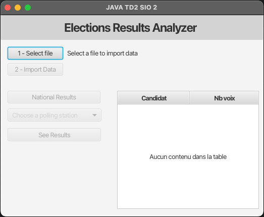

# TD 2 Java : Import de fichiers et manipulation de HashMaps

## Objectifs

Importer des fichiers CSV et de les manipuler en utilisant des HashMaps.

Vous devrez réaliser une application permettant de fournir les résultats d'une élection 
à partir de liste des bulletins de votes fournis en CSV. ( Vous disposez de 2 fichiers csv dans le dossier `/docs`)

2 types de résultats seront à fournir :
- La ventilation des votes au niveau national
- La ventilation des votes pour chaque bureau de votes.

## Screenshots interfaces

